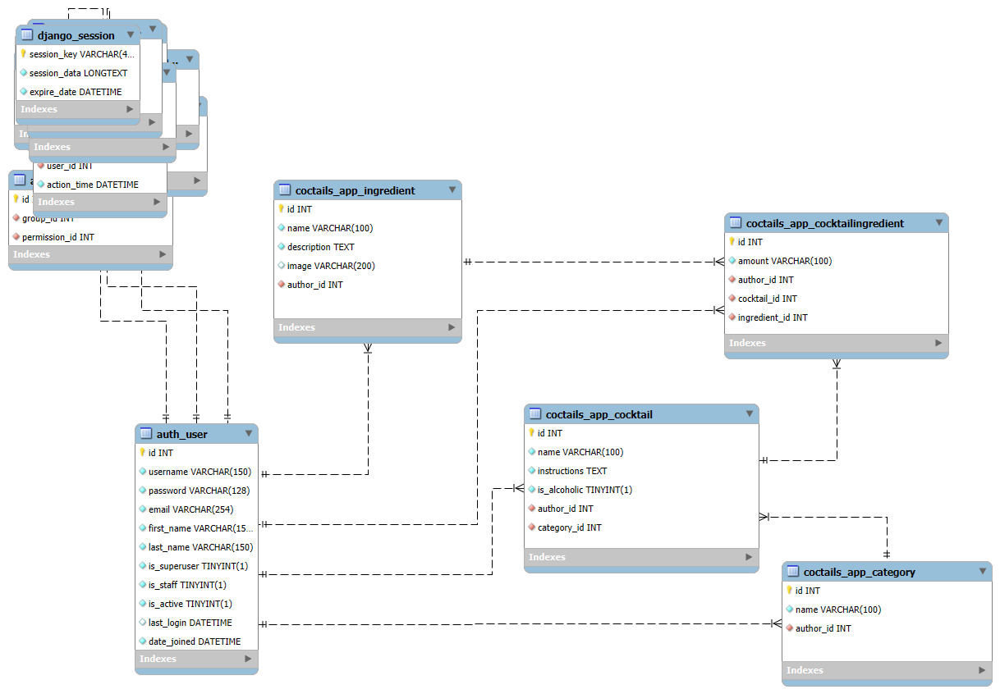

Repo zawiera rozwiązanie zadania rekrutacyjnego do KN Solvro do sekcji Backend.
Wykonano REST API do zarządzania koktajlami oraz ich składnikami w Django.

Zaimplementowano następujące elementy:

- relacyjną bazę danych
- paginację przy listowaniu koktajli oraz składników
- walidację danych wejściowych: przy tworzeniu obiektów jak i filtorwaniu w endpointach
- autoryzację oraz użytkowników:
  - system rejestracji i logowania mechanizmem wbudowanym w Django
  - role użytkowników:
    - użytkownik
    - administrator(root)
  - system uprawnień:
    - każdy użytkownik może przeglądać koktajle
    - tylko zalogowany użytkownik może dodawać przepisy
  - zasady autoryzacji:
    - edycja i usuwanie koktajlu możliwa jest tylko przez:
      - autora
      - administratora
  - powiązanie koktajlu z jego autorem
- automatycznie generowaną dokumentację API,OpenAPI

